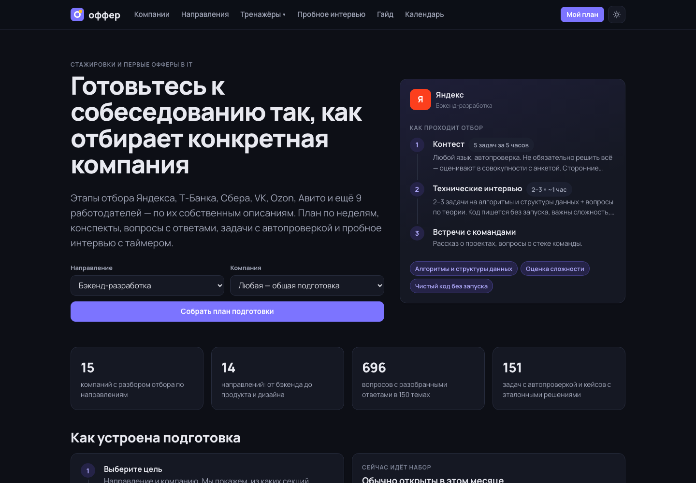
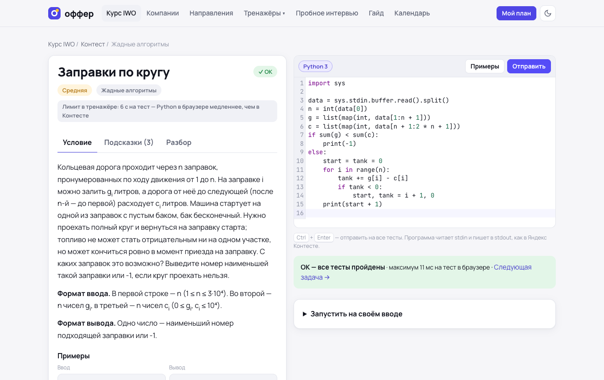

# Оффер — подготовка к стажировкам в IT

Сайт для подготовки к отбору на стажировки и первые собеседования в российских IT-компаниях. Выбираешь направление и компанию — получаешь разбор того, как именно она отбирает, план по неделям и тренажёры под каждую секцию.

Живая версия: https://z1nex.online/offer/



## Что внутри

- **15 компаний**: Яндекс, Т-Банк, Сбер, VK, Ozon, Авито, Wildberries & Russ, Лаборатория Касперского, МТС, Альфа-Банк, X5 Tech, Positive Technologies, Т1, Контур, билайн. Для каждой — этапы отбора по направлениям, длительность секций, что проверяют, условия, сроки наборов и источники.
- **14 направлений**: бэкенд (Python, Go, Java, C++), фронтенд, iOS, Android, ML, аналитика данных, инженерия данных, системный анализ, QA, DevOps/SRE, ИБ, продакт, проджект, продуктовый дизайн.
- **150 конспектов** и **696 вопросов с ответами**; режим карточек с интервальным повторением.
- **Intern week offer в Яндексе**: сроки осени 2026, две технические секции для бэкенда и ML, ограничения на участие.
- **72 алгоритмические задачи** с автопроверкой на Python (Pyodide) и JavaScript прямо в браузере, подсказками и разбором.
- **37 SQL-задач** на пяти учебных базах (магазин, сотрудники, продуктовые события, A/B-тест, банк), выполняются в SQLite через WebAssembly.
- **35 задач «что выведет JS»** про event loop, this, замыкания и приведение типов.
- **43 кейса**: продуктовые, аналитические, системный и ML-дизайн, тестирование, инциденты, безопасность, требования — с таймером, эталоном и критериями самопроверки.
- **План подготовки** под срок, часы в неделю и стартовый уровень, с автоматическим учётом прогресса.
- **Пробное интервью** в формате выбранной компании: код, теория, кейс, поведенческая часть, итоговый отчёт со слабыми темами.
- Гайд по подготовке, календарь наборов, поведенческое интервью с конструктором самопрезентации.

Прогресс хранится в браузере, его можно выгрузить в файл и перенести на другое устройство.

## Курс к Intern week offer

Отдельный раздел `/iwo` — курс для бэкенд-трека на Python: от первой программы до уровня отборочного контеста и технических секций.



- **Диагностика уровня**: вопросы трёх уровней по темам, каждый привязан к уроку. Уроки, на все вопросы которых ответ верный, план пропускает.
- **План по дням** до дедлайна контеста и недели секций: часы в день, дата контеста, стартовый уровень; выполненное отмечается само.
- **Уроки по модулям** — Python, сложность, массивы, хеш-таблицы, сортировки, жадные алгоритмы, бинпоиск, префиксные суммы, стек и очередь, рекурсия, деревья, графы, куча, динамика, строки, теория бэкенда. В каждом уроке код, типичные ошибки, сложность, самопроверка и вопросы, которые задают на собеседовании. Сведения об отборе Яндекса — только со ссылками на источники.
- **Задачи в формате Яндекс Контеста**: stdin/stdout, эталонное решение, генератор тестов, сверенных с перебором, вердикты OK/WA/RE/TL в Pyodide.
- **Подборки задач CodeRun** по модулям, от простых к сложным; задачи из подборок собеседований идут первыми.
- **Пробный контест с таймером**, режим собеседования (таймер, без подсказок и разбора) и повторение вопросов из пройденных уроков с растущими интервалами: 1, 3, 7, 16 дней.

Контент лежит в Markdown в `app/src/course/content`; тесты собирает `app/tools/build-contest.py`.

## Запуск

```bash
cd app
npm install
npm run dev
```

Сборка статического сайта — `npm run build`, результат в `app/dist`. Роутинг на хешах, поэтому сайт работает с любого пути без настройки сервера.

## Проверка данных

```bash
cd app
npm run verify
```

Скрипт проверяет, что все темы на месте и связаны с направлениями, прогоняет эталонные решения задач на Python и JS по всем тестам, выполняет эталонные SQL-запросы и запускает код квиза в Node.js, сверяя вывод с ответами. Для курса он разбирает все уроки, диагностику и задачи, проверяет ссылки между ними и запускает код из вопросов «Что выведет код?», сравнивая вывод с отмеченным ответом.

## Стек

React 19, TypeScript, Vite, React Router, CodeMirror 6, sql.js, Pyodide, marked.

## Данные

Этапы отбора взяты с официальных карьерных страниц компаний, из их инженерных блогов и публичных разборов кандидатов. На странице каждой компании отмечено, какие сведения официальные, и приведены ссылки. Список источников ресерча — в [research/SOURCES.md](research/SOURCES.md). Данные собраны в сентябре 2026 года; сроки наборов меняются каждый сезон.

## Лицензия

MIT
